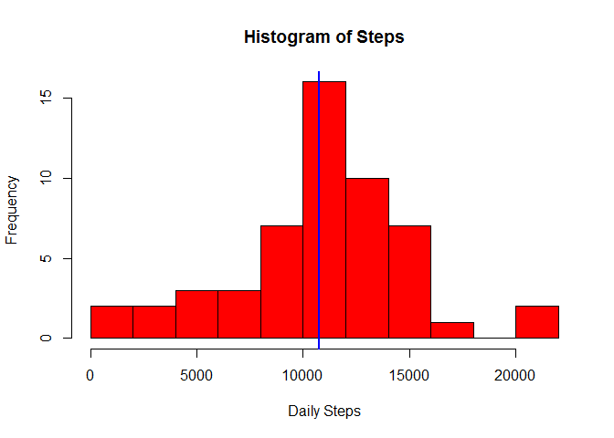
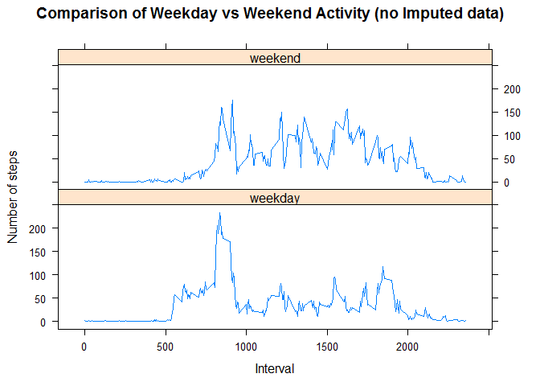
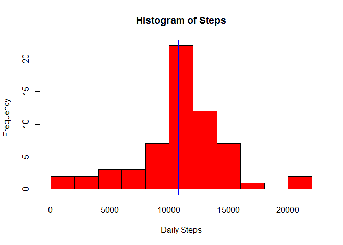
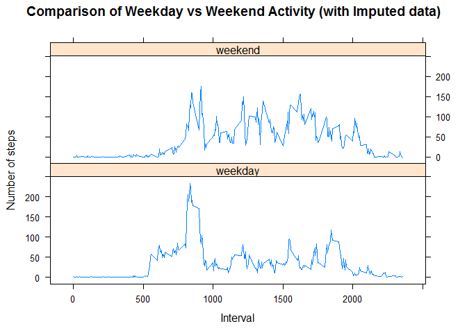

# Reproducible Research: Peer Assessment 1


## Acquire and load the source data

Obtain a copy of the data from an official source if a copy is not available locally.  Then load the data into a dataframe (identifying NA values as necessary).


```r
dataUrl <- "https://d396qusza40orc.cloudfront.net/repdata%2Fdata%2Factivity.zip"
dataFile <- "activity.csv"
zipFile <- "activity.zip"
if (!file.exists(zipFile)) { 
   download.file(url= dataUrl, destfile= zipFile, quiet= T ) 
}

if (!file.exists(dataFile)) { 
   unzip(zipfile= zipFile, files= dataFile) 
} 

activityData <- read.csv(dataFile, na.strings = "NA")
```

## Locate and install supporting library packages:

Load library packages that will help with working with dates and generating graphs/plots.


```r
if (!require('dplyr')) 
{
  install.packages('dplyr', repos = 'http://cran.us.r-project.org');
  library(dplyr);
}
if (!require('timeDate')) 
{
  install.packages('timeDate', repos = 'http://cran.us.r-project.org');
  library(timeDate);
}
if (!require('ggplot2')) 
{
  install.packages('ggplot2', repos = 'http://cran.us.r-project.org');
  library(ggplot2);
}
if (!require('lattice')) 
{
  install.packages('lattice', repos = 'http://cran.us.r-project.org');
  library(lattice);
}
```

## What is mean total number of steps taken per day?


```r
aggData <- aggregate(steps ~ date, data=activityData, FUN=sum)
meanSteps <- mean(aggData[,2])
hist(aggData[,2], xlab= "Daily Steps",  main = "Histogram of Steps", breaks=14, col="red")
abline(v=meanSteps, lwd=2, col="blue")
```

 

```r
summary(aggData)
```

```
##          date        steps      
##  2012-10-02: 1   Min.   :   41  
##  2012-10-03: 1   1st Qu.: 8841  
##  2012-10-04: 1   Median :10765  
##  2012-10-05: 1   Mean   :10766  
##  2012-10-06: 1   3rd Qu.:13294  
##  2012-10-07: 1   Max.   :21194  
##  (Other)   :47
```

## What is the average daily activity pattern?


```r
intervalData <- aggregate(steps ~ interval, data=activityData, FUN=mean)
plot(intervalData, type="l")
```

 

## Are there differences in activity patterns between weekdays and weekends?

* Note: The following is a plot where entries with missing data has been excluded.  Later in the report will be a plot where values were imputed for the missing data.


```r
activityData$dayType <- as.factor(c("weekend", "weekday")[(isWeekday(as.Date(activityData$date)))+1L])
activityData_noNAs <- group_by(na.omit(activityData), dayType, interval)
summaryByDayType_Interval <- summarise(activityData_noNAs, mean(steps))
colnames(summaryByDayType_Interval) <- c("dayType", "interval", "step_mean")
attach(summaryByDayType_Interval)
xyplot(step_mean~interval|dayType, data=summaryByDayType_Interval, xlab= "Interval", ylab= "Number of steps", main= "Comparison of Weekday vs Weekend Activity (no Imputed data)", type="l", layout=c(1,2))
```

 

## Imputing missing values


```r
imputeSteps <- function(paramInterval, paramDayType) {
  filter(summaryByDayType_Interval, interval==paramInterval,dayType==paramDayType)$step_mean
}  
missingValues <- subset(activityData, is.na(activityData$steps))
lengthMissingValues <- dim(missingValues)[1]
for (i in 1:lengthMissingValues) {
  missingValues[i,]$steps <- imputeSteps(missingValues[i,"interval"],         missingValues[i,"dayType"])
}
combinedDataSet <- rbind(activityData_noNAs, missingValues)
aggCombinedData<- aggregate(steps ~ date, data=combinedDataSet, FUN=sum)
meanSteps <- mean(aggCombinedData[,2])
hist(aggCombinedData[,2], xlab= "Daily Steps",  main = "Histogram of Steps", breaks=14, col="red")
abline(v=meanSteps, lwd=2, col="blue")
```

 

```r
summary(aggCombinedData)
```

```
##          date        steps      
##  2012-10-01: 1   Min.   :   41  
##  2012-10-02: 1   1st Qu.: 9819  
##  2012-10-03: 1   Median :10571  
##  2012-10-04: 1   Mean   :10762  
##  2012-10-05: 1   3rd Qu.:12811  
##  2012-10-06: 1   Max.   :21194  
##  (Other)   :55
```

## Weekday and weekend Activity Patterns with Imputed Values

```r
attach(aggCombinedData)
xyplot(step_mean~interval|dayType, data=aggCombinedData, xlab= "Interval", ylab= "Number of steps", type="l", main= "Comparison of Weekday vs Weekend Activity (with Imputed data)", layout=c(1,2))
```

 

